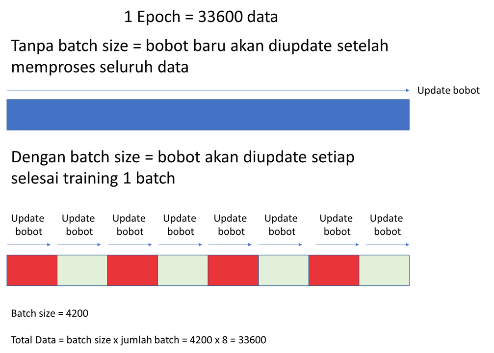

<style>
body {
text-align: justify}
</style>

```{r}
# clear-up the environment
rm(list = ls())

# chunk options
knitr::opts_chunk$set(
  message = FALSE,
  warning = FALSE,
  fig.align = "center",
  comment = "#>"
)

# scientific notation
options(scipen = 9999)
```

# Deep Learning with Keras

Untuk selanjutnya, kita akan menggunakan `Keras` dalam membuat arsitektur dan melakukan training model. `Keras` adalah package yang membantu kita mengimplementasikan model Deep Learning dengan cepat. `Keras` memanfaatkan `tensorflow`, sebuah tools open source yang dikembangkan oleh Google untuk implementasi Deep Learning.

## Verify `keras` installation

```{r}
library(keras)
library(tensorflow)
model <- keras_model_sequential()
```

# MNIST Data Analysis

Seperti yang sudah disampaikan di awal, deep learning merupakan sebuah framework yang sering digunakan ketika menghadapi *data unstructured*. Maka dari itu mari kita lakukan  **image classification** menggunakan deep learning dengan framework `keras`. Kita akan gunakan data MNIST yang berisi data image tentang tulisan tangan untuk beragam angka. Kita akan coba klasifikasikan setiap tulisan tangan ke label angka yang sesuai.

Data Source: [kaggle](https://www.kaggle.com/competitions/digit-recognizer/data?select=train.csv)

## Read Data

Data MNIST ada pada folder `data_input/mnist`:

- train.csv -> utk cross validation (train-validation)
- test.csv -> utk data test

```{r}
# Read mnist train
train <- read.csv("data_input/mnist/train.csv")

# Read mnist train
test <- read.csv("data_input/mnist/test.csv")
```

## Exploratory Data

Pada tahapan eksplorasi data kali ini, mari coba jawab beberapa pertanyaan di bawah ini.

- Berapa dimensi data pada data train kita?

```{r}
# Please type your answer
dim(train)
```

Row: 42rb
Kolom: 785

- Berapa banyak category yang ada pada kelas target? dan bagaimana proporsinya?

```{r}
# Please type your answer
train$label %>% 
  unique()
```

```{r}
train$label %>% 
  table()
```

- Berapa banyak prediktor yang ada?

785 Kolom
1 Kolom label/target
784 prediktor

- Berapa range nilai dari prediktor yang digunakan?

```{r}
# Please type your answer
library(tidyverse)
train %>% 
  select(-label) %>% 
  range()
```

```{r}
train %>% 
  head(2)
```

- Bila 1 baris data merepresentasikan 1 gambar dengan bentuk persegi (sisi*sisi) maka berapa ukuran gambar tesebut?

```{r}
# Please type your answer
sqrt(784)
```

- Apa yang anda ketahui terkait pixel?


- Visualisasi gambar

```{r}
vizTrain <- function(input) {
    
    dimmax <- sqrt(ncol(train[, -1]))
    
    dimn <- ceiling(sqrt(nrow(input)))
    par(mfrow = c(dimn, dimn), mar = c(0.1, 0.1, 0.1, 
        0.1))
    
    for (i in 1:nrow(input)) {
        m1 <- matrix(input[i, 2:ncol(input)], nrow = dimmax, 
            byrow = T)
        m1 <- apply(m1, 2, as.numeric)
        m1 <- t(apply(m1, 2, rev))
        
        image(1:dimmax, 1:dimmax, m1, col = grey.colors(255), 
            xaxt = "n", yaxt = "n")
        text(2, 20, col = "white", cex = 1.2, train[i, 
            1])
    }
    
}

# visualisasi
vizTrain(train[1:25, ])
```

## Cross Validation

Lakukan cross validation menggunakan initial_split dengan proporsi 80% data untuk data training.

```{r}
RNGkind(sample.kind = "Rounding")
library(rsample)
set.seed(100)

# Spliting
mnist_split <- initial_split(data = train,
                             prop = 0.8,
                             strata = "label")

# Data train
mnist_train <- training(mnist_split)

# Data validation
mnist_validation <- testing(mnist_split)
```

## Data pre-processing

Sebelum membuat model dengan `Keras`, ada beberapa hal yang perlu dilakukan untuk mempersiapkan data:

1. Memisahkan prediktor dengan target variabel
2. Scalling data 
3. Mengubah format data menjadi array. Dari data.frame -> matrix -> array
4. Melakukan one-hot encoding apabila target variabel adalah kategori

### Pisahkan target-prediktor, ubah data menjadi matrix serta melakukan scalling

Scalling dengan membagi data dengan angka 255 agar range data yang dimiliki menjadi 0 hingga 1.

```{r}
# ambil prediktor dan lakukan scaling
#prediktor
library(dplyr)
train_x <- mnist_train %>% 
  select(-label) %>% 
  as.matrix() /255

validation_x <- mnist_validation %>% 
  select(-label) %>% 
  as.matrix() /255 

#target
train_y <- mnist_train %>% 
  select(label)

validation_y <- mnist_validation %>% 
  select(label)
```

### Processing prediktor: Mengubah matrix menjadi array

Framework keras menerima data dalam bentuk *array*. Sehingga data prediktor dalam bentuk matrix perlu diubah ke dalam bentuk array menggunakan `array_reshape()`.

Keras : mengenal tipe data yang ada di python (array)

```{r}
# prediktor
train_x_keras <- train_x %>% 
  array_reshape(dim = dim(train_x))

validation_x_keras <- validation_x %>% 
  array_reshape(dim = dim(validation_x))
```

### Processing target: One Hot Encoding

Ubah target (data kategorik) menjadi variable *One Hot Encoding* menggunakan fungsi `to_categorical()`:

```{r}
# Please type your answer
train_y_keras <- train_y %>% 
  as.matrix() %>% 
  to_categorical()

validation_y_keras <- validation_y %>% 
  as.matrix() %>% 
  to_categorical()
```

## Model Building

Tahapan pembuatan model neural network/deep learning di Keras:

1. Define Architecture
2. Compile with training parameters
3. Fitting (training) Model
4. Evaluate
5. Predict

### Define Architecture

Tahapan yang pertama kali kita lakukan adalah membangun arsitektur dari model deep learning kita. Berikut, ada beberapa ketentuan dalam membantu arsitektur model deep learning dengan menggunakan *Keras*.

*Step 1* Selalu diawali `keras_model_sequential()`

```{r}
# keras initialization
model <- keras_model_sequential()
```

Note:
- `keras_model_sequential()` adalah inisialisasi awal pembuatan model
- Ketika ingin mengubah sedikit saja parameter dari model, maka harus di run ulang dari `keras_model_sequential()`

*Step 2* Membangun setiap layer (Input, Hidden & Output)

Dalam membangun setiap layer yang ada, Keras akan mengimplementasikan sistem *layer by layer*. Dimana, layer pertama yang dibuat akan menjadi hidden layer pertama dan layer terakhir yang dibuat akan menjadi output layer.

Fungsi yang dapat kita gunakan dalam membangun setiap layer adalah `layer_dense()`, pada fungsi tersebut nantinya akan kita isi dengan beberapa parameter berikut ini.

- `input_shape`: mendefinisikan jumlah input nodes. 
  * Parameter ini hanya digunakan pada fungsi `layer_dense()` yang paling pertama.
- `units`: mendefinisikan jumlah nodes dalam layer tersebut.
- `activation`: mendefinisikan Activation Function yang digunakan.
  * *linear*: Activation ini digunakan untuk kasus regregsi (range: -inf ~ inf)
  * *logistic*: Activation ini digunakan untuk kasus klasifikasi biner (range: 0 ~ 1)
  * *softmax*:  Activation ini digunakan untuk kasus klasifikasi multiclass (range 0 ~ 1)
  * *reLu*: Activation ini cocok di hidden layer untuk kasus data image (range: 0 ~ inf)
  * *tanh*:Activation ini cocok di hidden layer bila nilai prediktor banyak yang negatif (range: -1 ~ 1)
- `name`: untuk penamaan layer (demi kemudahan visualisasi/summary). 

```{r}
# Untuk mengunci random
tensorflow::tf$random$set_seed(123)
 
# Please type your answer
model %>% 
  layer_dense(input_shape = 784, # untuk mengdefinisikan jumlah node pada input layer
              units = 256,
              activation = "relu",
              name = "Hidden_1") %>% 
  layer_dense(units = 64,
              activation = "relu",
              name = "Hidden_2") %>% 
  layer_dense(units = 16,
              activation = "relu",
              name = "Hidden_3") %>% 
  layer_dense(units = 10,
              activation = "softmax",
              name = "Output")

# Untuk melihat hasil arsitektur yang sudah dibuat
summary(model)
```

Keterangan:

- `Total params` = Jumlah bobot yang dimiliki oleh model
- `Trainable param` = parameter/koneksi yang bobotnya bisa berubah sesuai dengan proses training
- `Non-trainable param` = nilai bobot/parameter tidak berubah atau dikunci nilainya

### Compile a Model

Pada tahapan membangun arsitektur, kita belum memberikan perhitungan error yang akan digunakan. Pada tahapan inilah kita akan memberikan cara perhitungan error, dengan menggunakan fungsi `compile()`. Jenis perhitungan error dapat kita definisikan dengan menggunakan parameter `loss = `. Pada parameter tersebut dapat kita isi dengan 3 value, seperti di bawah ini.

- klasifikasi multiclass (3 target variable): `categorical_crossentropy`
- klasifikasi biner (2 target variable): `binary_crossentropy`. 
- regresi: `mean_square_error`

Akan tetapi, setelah kita mendapatkan hasil dari perhitungan error yang terjadi, model kita perlu untuk melakukan *back propagation* untuk memperbaiki bobo agar errornya berkurang. Untuk melakukan hal tersebut kita juga dapat menambahkan parameter `optimizer = `. Pada parameter optimizer terdapat 2 fungsi yang dapat kita isi, yaitu `optimizer_sgd()` dan `optimizer_adam()`.

- Optimizer SGD/`optimizer_sgd()`: Merupakan pembaharuaan dari cara perhitungan Gradient Decent yang sudah di-implementasikan pada fungsi `neuralnet()`.
- Optimizer Adam/`optimizer_adam()`: Merupakan pembaharuaan dari metode Optimizer SGD.
  * Para setiap fungsi optimzer dapat kita tambahkan dengan sebuah parameter baru, yaitu `learning_rate =` untuk mengatur seberapa cepat penurunan bobotnya.

Parameter terakhir yang dapat kita tambahkan juga ke fungsi `compile()` adalah parameter `metric = `. Parameter tersebut dapat kita isi denagn `accuracy` untuk melihat nilai accuracy-nya yang dihasilkan.

```{r}
# Please type your answer
model %>% 
  compile(loss = "categorical_crossentropy",
          optimizer = optimizer_adam(learning_rate = 0.001),
          metric = "accuracy")
```

### Fit (Training Model)

Setelah arsitektur dari model Deep Learning kita sudah siap, kita akan memulai tahapan trainingnya. Untuk melakukan training model, kita akan memnggunakan fungsi `fit()`. Pada fungsi tersebut dapat kita isi dengan beberapa parameter berikut ini,

- `x`: Prediktor
- `y`: Target variabel
- `epochs`: Jumlah epoch atau jumlah iterasi yang dilakukan untuk model belajar
  * Intuisinya sama dengan jumlah step yang dihasilkan dari fungsi `neuralnet()`
- `validation_data`: Data validation/unseen data untuk dilihat metrik evaluasinya
- `verbose`: Apakah ingin menampilkan visualisasi selama training berlangsung
- `batch_size`: Model akan mengupdate bobot setiap **n** data

*Apa itu batch size?*

Terminologi pada neuralnet yang kita pelajari sebelumnya & keras agak berbeda. Pada keras, model yang dibuat hanya 1 buah, namun proses trainingnya dapat dilakukan beberapa kali. Pada tiap proses training, dilakukan pembagian data ke beberapa **batch** melalui random sampling. Model akan ditraining menggunakan data pada batch 1 terlebih dahulu, kemudian batch selanjutnya, hingga digunakan seluruh data (1 **epoch**). 

Model dapat ditraining lebih dari 1 epoch (berarti melakukan pembagian batch dengan random sampling yang berbeda dari sebelumnya). Pada tiap epoch, error dan accuracy (metrics) model dapat di track. Bila ditinjau, semakin bertambah epoch, model akan memiliki error semakin kecil dan accuracy yang semakin tinggi.

```{r}

```

--- End of Day 3 ---

Hal yang perlu di HIGHLIGHT:

- *Semakin banyak batch* maka proses *training semakin lama* (karena proses optimasi model semakin banyak)
- *Semakin banyak epoch* maka *error bisa lebih kecil*, namun proses *training semakin lama* dan rentan *overfitting*. 
  + dapat ditentukan epoch yang tidak terlalu tinggi dahulu
  + perubahan error tiap epoch dapat dilihat melalui plot

```{r}
# JANGAN RUN 2X! Karena akan melanjutkan proses training. Bila ingin run lagi, ulang dari `keras_model_sequential()`

# selisih acc train & test dibilang overfit ~  10-15 %

history <- model %>% 
           fit(
             x=train_x_keras, # prediktor data train
             y=train_y_keras, # target data train
             batch_size = 100, # jumlah data dalam 1 batch
             epochs = 10, # generally, isi 10
             validation_data = list(validation_x_keras,validation_y_keras)
           )
```

Plotting Model:

```{r}
plot(history)
```

### Predict

Melakukan prediksi pada data validation `validation_x_keras` dengan menggunakan fungsi `predict()`

```{r}
# Please type your answer
predict_class <- predict(model, validation_x_keras) %>%  k_argmax() %>% 
    as.matrix() %>% as.factor()

```

```{r}
# melihat hasil prediksi
predict_class %>% 
  head()
```

### Evaluation

Evaluasi kebaikan model dalam memprediksi menggunakan `confusionMatrix()`:

```{r}
test %>% head()
# Please type your answer
caret::confusionMatrix(predict_class, as.factor(mnist_validation$label), mode='everything')

# F1-score, add param mode = 'everything'
```

**NOTE**: Bila hasil metrics masih ingin ditingkatkan, kita dapat melakukan model tuning kembali pada pembuatan model nn maupun tahap pre-processing lainnya.

### Save & Load Model

Dikarenakan dalam proses training model memerlukan waktu yang tidak sebentar, kita akan menyimpan terlebih dahulu model yang sudah semmpat kita buat dengan menggunakan fungsi `save_model_tf()`

```{r eval=FALSE}
# save
model %>% 
  save_model_tf(filepath="model_dl_theia")
```

Untuk memanggil hasil model yang disimpan dengan menggunakan fungsi `save_model_tf()`, kita dapat menggunakan funsi `load_model_tf()`

```{r}
model_loaded <- load_model_tf(filepath='model_dl_theia')
```


# Dive Deeper

Buat model deep learning baru menggunakan data train yang sama dan simpan ke dalam objek `model_nama-anda`. 

* Buat arsitektur arsitektur model dengan:
  - input layer: jumlah node: ncol(train_x_keras) = 784
  - hidden layer 1: jumlah node ...; activation function ReLu
  - hidden layer 2: jumlah node ...; activation function ReLu
  - hidden layer 3: jumlah node ...; activation function ReLu
  - output layer: jumlah node 10; activation function softmax
* Compile dengan training parameter:
  - loss (cost function) : ...
  - optimizer ...; learning rate = ...
  - metric = accuracy
* Fitting:
  - Gunakan epoch & batch size sesuai dengan keinginan anda.

Step 1: Build architecture

```{r}
model_dd <- keras_model_sequential()
```

Step 2: Compile model

```{r}
model_dd %>% 
  layer_dense(input_shape = 784, # untuk mengdefinisikan jumlah node pada input layer
              units = 256,
              activation = "relu",
              name = "Hidden_1") %>% 
  layer_dense(units = 64,
              activation = "relu",
              name = "Hidden_2") %>% 
  layer_dense(units = 16,
              activation = "relu",
              name = "Hidden_3") %>% 
  layer_dense(units = 10,
              activation = "softmax",
              name = "Output")
```

Step 3: Fit (training) model

```{r}
model_dd %>% compile(
  loss='categorical_crossentropy',
  optimizer=optimizer_sgd(),
  metric=c('accuracy')
)
  
```

Step 4: Plot model

```{r, eval = F}
history_dd <- model_dd %>% fit(
  x=train_x_keras, # prediktor data train
   y=train_y_keras, # target data train
   batch_size = 100, # jumlah data dalam 1 batch
   epochs = 10, # generally, isi 10
   validation_data = list(validation_x_keras,validation_y_keras)
)
```

Step 5: Lakukan prediksi ke data validation:

```{r}
predict_dd <- predict(model_dd, validation_x_keras) %>% k_argmax() %>% as.matrix() %>% as.factor()
# predict_dd %>% unique()
```

Step 6: Evaluasi

```{r}
caret::confusionMatrix(predict_dd, as.factor(mnist_validation$label), mode='everything')
```

```{r}
model_dd2 <- keras_model_sequential()
model_dd2 %>% 
  layer_dense(input_shape = 784, # untuk mengdefinisikan jumlah node pada input layer
              units = 200,
              activation = "relu",
              name = "Hidden_1") %>% 
  layer_dense(units = 50,
              activation = "relu",
              name = "Hidden_2") %>% 
  layer_dense(units = 12,
              activation = "relu",
              name = "Hidden_3") %>% 
  layer_dense(units = 10,
              activation = "softmax",
              name = "Output")
model_dd2 %>% compile(
  loss='categorical_crossentropy',
  optimizer=optimizer_rmsprop(learning_rate=0.001),
  metric=c('accuracy')
)
history_dd2 <- model_dd2 %>% fit(
  x=train_x_keras, # prediktor data train
   y=train_y_keras, # target data train
   batch_size = 100, # jumlah data dalam 1 batch
   epochs = 10, # generally, isi 10
   validation_data = list(validation_x_keras,validation_y_keras)
)
predict_dd2 <- predict(model_dd2, validation_x_keras) %>% k_argmax() %>% as.matrix() %>% as.factor()
caret::confusionMatrix(predict_dd2, as.factor(mnist_validation$label), mode='everything')
```

```{r}
test_clean <- test %>% as.matrix() / 255
test_clean <- test_clean %>% array_reshape(dim = dim(test_clean))
```

```{r}

model_dd3 <- keras_model_sequential()
model_dd3 %>% 
  layer_dense(input_shape = 784, # untuk mengdefinisikan jumlah node pada input layer
              units = 260,
              activation = "relu",
              name = "Hidden_1") %>% 
  layer_dense(units = 50,
              activation = "relu",
              name = "Hidden_2") %>% 
  layer_dense(units = 15,
              activation = "relu",
              name = "Hidden_3") %>% 
  layer_dense(units = 10,
              activation = "softmax",
              name = "Output")

model_dd3 %>% compile(
  loss='categorical_crossentropy',
  optimizer=optimizer_rmsprop(learning_rate=0.001),
  metric=c('accuracy')
)

history_dd3 <- model_dd3 %>% fit(
  x=train_x_keras, # prediktor data train
   y=train_y_keras, # target data train
   batch_size = 200, # jumlah data dalam 1 batch
   epochs = 11, # generally, isi 10
   validation_data = list(validation_x_keras,validation_y_keras)
)

predict_dd3 <- predict(model_dd3, test_clean) %>% k_argmax() %>% as.matrix() %>% as.factor()
# caret::confusionMatrix(predict_dd3, as.factor(mnist_validation$label), mode='everything')
```

# KAGGLE

```{r}
submission_kaggle <- 
  data.frame(ImageId=1:nrow(test),Label=predict_dd3)

write.csv(submission_kaggle,'submission_kaggle.csv')
```


# Summary 

**Data Pre-processing untuk Keras**

* Data dalam bentuk `data.frame` diubah terlebih dahulu menjadi `array` karena keras menerima input dalam bentuk array. Tahapan: data.frame -> matrix -> array.
* Pengubahan data dalam bentuk matrix ke array:
  + data prediktor diubah menggunakan fungsi `array_reshape()`
  + data target (label) diubah menggunakan fungsi `to_categorical()`

**Tahapan Model Building di Keras:**

1. Define Model Architecture:
  * layers & node
  * activation function
2. Compile a Model:
  * optimizer (metode back propagation)
  * cost/loss function
  * metrics
3. Fit (train model):
  * batch size
  * epochs
4. Predict
5. Evaluate

**Panduan Model Building & Tuning:**

* Nodes pada input layer: sejumlah prediktor yang kita miliki.
* Nodes pada output layer: 
  + regresi = 1
  + klasifikasi = sejumlah kelas variable target
* Hidden layer: 
  + jumlah hidden layer (how deep): 
    - model lebih kompleks
    - waktu training lebih lama
    - percobaan pertama bisa buat 2 layer dulu
  + jumlah node pada hidden layer (how wide): 
    - terlalu banyak bisa menghasilkan overfitting.
    - bisa pakai angka kelipatan 2^n (2,4,8,16,32,64,128, dst..), kisaran 2/3 jumlah prediktor
    - jumlah mengerucut semakin ke output layer 
* Cost function:
  + regresi: sum of squared error (sse)
  + klasifikasi: cross-entropy (ce)
* Activation function:
  + output layer:
    - linear: regresi
    - logistic: klasifikasi biner
    - softmax: klasifikasi multiclass
  + hidden layer:
    - ReLu: data image
    - tanh: data yang nilai prediktornya banyak yang negatif
* Metode back propagation (optimizer): 
  + gradient descent (gunakan `optimizer_sgd()` di Keras)
  + adam (gunakan `optimizer_adam()`)
* Batch yang banyak (batch_size = kecil) mencegah komputasi terlalu besar dalam 1 waktu
* Epoch yang semakin banyak maka:
  + proses training semakin lama
  + error bisa lebih kecil
  + terlalu banyak akan rentan overfitting 
  + dapat ditentukan epoch yang tidak terlalu tinggi dahulu: 10 atau 15
  + perubahan error tiap epoch dapat dilihat melalui plot; di cut pada perubahan accuracy (metrics) yang sudah landai.

# Additional Link & References

1. ["A (Quick) Guide to Neural Network Optimizers with Applications in Keras", Andre Ye, March 2020](https://towardsdatascience.com/a-quick-guide-to-neural-network-optimizers-with-applications-in-keras-e4635dd1cca4)
2. ["Various Optimization Algorithms For Training Neural Network", Sanket Doshi, Jan 2019](https://towardsdatascience.com/optimizers-for-training-neural-network-59450d71caf6#:~:text=Optimizers%20are%20algorithms%20or%20methods,order%20to%20reduce%20the%20losses.&text=Optimization%20algorithms%20or%20strategies%20are,the%20most%20accurate%20results%20possible.)
3. [Deep Learning Tips and Tricks cheatsheet, By Afshine Amidi and Shervine Amidi, Stanford Edu](https://stanford.edu/~shervine/teaching/cs-230/cheatsheet-deep-learning-tips-and-tricks)
4. [Various cases on Deep Learning at algotech.netlify.app](https://algotech.netlify.app/tags/deep-learning/)
5. [Visual Explanation of Neural Network by 3Blue1Brown](https://www.youtube.com/watch?v=aircAruvnKk&t=850s)
6. [The Age of AI, YouTube Originals](https://www.youtube.com/watch?v=UwsrzCVZAb8&t=111s): This is specially good for you who want to know how far the innovation of AI have been and more later in the future, shape our way of living.


