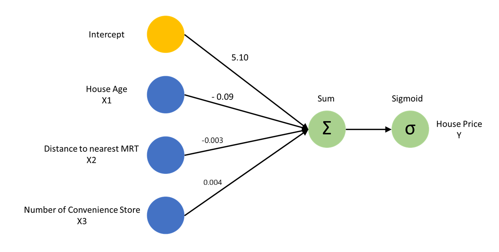

<style>
body {
text-align: justify}
</style>

```{r}
# clear-up the environment
rm(list = ls())

# chunk options
knitr::opts_chunk$set(
  message = FALSE,
  warning = FALSE,
  fig.align = "center",
  comment = "#>"
)

# scientific notation
options(scipen = 9999)
```

# Training Objective

```{r, echo=FALSE}
knitr::include_graphics("assets/Neural Network.png")
```

Berikut adalah beberapa tujuan yang akan kita capai dengan belajar Neural Network:

* Mengenal Neural Network
  - Konsep Neural Network
  - Neural Network dan Deep Learning
  
* Arsitektur Neural Network
  - Input Layer
  - Hidden Layer
  - Output Layer
  - Activation Function
  - Weigth
  - Bias

* Proses Belajar Neural Network
  - Error/Cost Function
  - Learning Rate
  - Feed Forward
  - Backpropagation

Tujuan pembahasan hari 1:

- Mengetahui perbedaan antara Traditional ML dengan Neural Network/Deep Learning
  ~ Secara konsep beserta fungsi
- Mengetahui bagaimana Neural Network belajar

# Neural Network and Deep Learning

Welcome to the last stage of Machine Learning Specialization, **Neural Network & Deep learning**! Topik ini erat kaitannya dengan teknologi mutakhir yang menjadi sorotan dunia saat ini yaitu **Artifical Intellegence**. Topik ini akan membuka gerbang ke perjalanan yang lebih menarik sekaligus menantang di ranah [Artificial Intellegence](https://www.youtube.com/watch?v=5IvQ3fYKnfM).

## Flashback Machine Learning

Kita refresh kembali materi awal tentang model regresi, baik regresi linear dan regresi logistik agar nantinya lebih familiar perbedaannya dengan arsitektur neural network.

### Linear Regression

Misalkan, kita mempunyai data harga rumah seperti berikut:

```{r}
# Please run the code 
house_prc_linear <- read.csv("data_input/house_price.csv")

head(house_prc_linear)
```

Deskripsi data:

- `age` : usia rumah
- `distance_to_mrt` : jarak ke stasiun MRT terdekat
- `num_conv_store` : jumlah toko kelontong di lingkungan sekitar
- `price` : kisaran harga rumah

Mari kita coba buat Linear Model untuk memprediksi harga rumah dengan menggunakan keseluruhan predictor.

```{r}
# Please type your answer
house_prc_linear_model <- lm(formula = price ~ .,
                             data = house_prc_linear)

house_prc_linear_model
```

Persamaan model regresi yang dihasilkan:

> price = 45.759308 intercept -0.346455 age  -0.005375 distance_to_mrt + 1.240674 num_conv_store

Intrepretasi:

- Setiap kenaikan 1 point pada variable `age`, akan menurunakn harga rumah sebesar 0.346455
- Setiap kenaikan 1 point pada variable `distance_to_mrt`, akan menurunkan harga rumah sebesar 0.005375
- Setiap kenaikan 1 point pada variable `num_conv_store`, akan menaikan harga rumah sebesar 1.240674 

Jika diilustrasikan dengan grafik menjadi sebagai berikut. Tanda $\Sigma$ menunjukkan bahwa `House Price` atau target variabel adalah hasil penjumlahan dari nilai masing-masing input atau prediktor yang dikali dengan bobot atau koefisiennya.

```{r out.width="80%", echo=FALSE}

```

### Logistic Regression

Sekarang kita coba beralih ke masalah klasifikasi, dengan data yang sama tapi variabel targetnya diubah menjadi kategori (low/high).

```{r}
# Please run the code 
house_prc_logistic <- read.csv("data_input/house_price_2.csv")

head(house_prc_logistic)
```

Deskripsi data:

- `age` : usia rumah
- `distance_to_mrt` : jarak ke stasiun MRT terdekat
- `num_conv_store` : jumlah toko kelontong di lingkungan sekitar
- `price` : kategori harga rumah (1 = high & 0 = low)

Mari kita coba buat Logistic Model untuk memprediksi harga rumah dengan menggunakan keseluruhan predictor.

```{r}
# Please type your answer
house_prc_logistic_model <- glm(formula =  price ~., 
                                data = house_prc_logistic, 
                                family = binomial)

house_prc_logistic_model
```

Persamaan log of odds yang dihasilkan oleh model logistic:

> price = 5.103873 intercept + -0.093332 age + -0.003873 distance_to_mrt + 0.004009  num_conv_store

Agar dapat menjadi sebuah nilai peluang untuk menentukan apakah harga rumah itu tinggi (1) atau rendah(0), maka kita menggunakan `Sigmoid function` untuk mengkonversi nilai peluangnya.

$$P(price) = \frac{1}{1 + e^{-Y}}$$

Contoh jika hasil dari model kita input ke visualisasi *Sigmoid Function*

```{r}
# Please run the code 
library(tidyverse)

data.frame(log_of_odd = predict(house_prc_logistic_model, house_prc_logistic)) %>% 
  mutate(prob = 1/(1 + exp(-log_of_odd))) %>% 
  ggplot(aes(log_of_odd, prob)) +
  geom_point(color = "red")+
  geom_line() +
  labs(x = "Log of Odds",
       y = "Probability") +
  theme_minimal()
```

Jika kita ilustrasikan dengan gambar, maka sebenarnya regresi logistik sama seperti regresi linear, yakni hasil perkalian nilai prediktor dengan nilai koefisiennya dijumlahkan terlebih dahulu, kemudian yang membedakan degnan regresi linear adalah setelah dijumlahkan hasilnya kemudian dikonversi menjadi sebuah peluang dengan range 0-1 menggunakan `Sigmoid function`.

```{r out.width="80%", echo=FALSE}
# Please run the code 

```

## Neural Network

Sistem saraf yang dimiliki manusia terdiri dari sel saraf yang dinamakan **neuron**, dan neuron tersebut amat banyak hingga membentuk **jaringan**. Tiap stimulus/input dari luar akan diterima oleh panca indra sebagai signal kemudian akan dialirkan melalui sel saraf satu ke sel saraf lainnya. Jaringan sel saraf tersebar dari ujung jari hingga otak dan berlanjut kembali ke seluruh tubuh kita. 
    
> Jaringan sel saraf terus mengalirkan informasi dari stimulus/**input**, diproses melalui otak, hingga diekspresikan melalui reaksi/aktivitas tubuh sebagai **output** atau respon yang kita berikan.

```{r, echo=FALSE}
knitr::include_graphics("assets/bnn.png")
```

### Arsitektur Neural Network

Komponen Neural Network:

- Neural Network terdiri dari 3 komponen utama : 
  * `Input layer` : variabel input (x1, x2, ..., xn)
  * `Hidden layer` : layer pemrosesan dan pembobotan data dari setiap variable input
  * `Output layer` : target variabel

Berikut adalah contoh komponen neural network untuk kasus klasifikasi harga rumah:

```{r out.width="80%", echo=FALSE}
knitr::include_graphics("assets/arsitektur nn.png")
```

Karakteristik Setiap Komponen Neural Network:

- `Input Layer`:
  * Jumlah node pada input layer akan sesuai dengan jumlah variable prediktor 
  * Selain node untuk variable prediktor, akan ada 1 node juga untuk nilai intercept/bias
  
- `Hidden Layer`:
  * Jumlah node pada hidden layer ditentukan oleh user
  * Akan ada 1 node juga untuk nilai intercept/bias
  
- `Output Layer`:
  * Jumlah node pada output layer sesuai dengan jumlah target variabel 

**Quick Glossary**

- `Node/Neuron`: Unit terkecil pada arsitektur neural network yang berfungsi untuk menyimpan informasi dan meneruskan informasi tersebut, sering disebut sebagai neuron.
- `Weight/Bobot`: Bobot yang menggambarkan besar informasi yang diteruskan dari setiap nodes. Pada gambar di atas, weight dilambangkan dengan garis. 
  * Bobot yang diberikan pada setiap nodenya di-inisiasi secara random
- `Fully Connected`: Setiap node pada setiap layer yang ada harus saling terhubung. 

### Kasus Regresi

Kita coba buat model Neural Network untuk data price dengan target variabel harga rumah (linear). Kita bisa menggunakan package `neuralnet` untuk membuat model Neural Network.

```{r}
# Please run the code 
library(neuralnet)
```

Dari package tersebut, fungsi yang akan kita gunakan adalah `neuralnet()`. Terdapat 4 parameter yang dapat kita gunakan pada fungsi tersebut, yaitu:

- `formula` : menentukan mana yang target mana yang prediktor yang ingin digunakan
- `data` : data yang ingin digunakan
- `hidden` : berapa jumlah node yang mau kita pakai di hidden layer tsb.
- `rep` : berapa banyak jumlah model yang ingin kita buat. 

Sebagai langkah awal, mari kita coba buat sebuah model neuralnet dengan jumlah node di hidden layernya sama dengan jumlah variable inputnya.

```{r}
# Please type your answer
set.seed(100)
model_nn_reg <- neuralnet(formula = price ~ ., 
                          data = house_prc_linear, 
                          hidden = 3, 
                          rep = 3)
```

*Quick Notes:* 

Setiap membuat model NN kita harus memberikan `set.seed()` karena pada step pertama bobot di inisiasi secara acak. Dengan adanya `set.seed()` berfungsi untuk mengunci acakan tersebut, sehingga tiap kali pemodelan dilakukan/dijalankan hasilnya tidak berubah2. 

Untuk melihat hasil terbaik dari beberapa model yang dibuat, kita dapat melihatnya dengan menggunakan fungsi di bawah ini.

```{r}
plot(model_nn_reg, rep = "best")
```

#### Proses Training Model

Proses pelatihan model dengan menggunakan konsep belajar neural network adalah *belajar dari kesalahan*. Proses belajarnya akan terus dilakukan sampai dengan model konvergen. Berikut runtut proses training model

*Step 1:*

Tahapan pertama yang dilakukan adalah memberikan **pembobotan/weight awal secara random**.

*Step 2:* 

Aliran informasi terjadi untuk melakukan prediksi dari **Input Layer -> Hidden Layer -> Output Layer**, aliran informasi tersebut biasanya disebut dengan **Feed Forward**.

*Step 2.1:*

Pada tahapan ini, setiap informasi yang masuk ke Hiden dan Output Layer akan dilakukan scalling. Tahapan scalling yang dilakukan sering juga disebut dengan **Activation Function**. Tujuan dilakukannya scaling ataupun peletakan **Activation Function** adalah:

- Menjaga agar nilai yang diteruskan ke node-node selanjutnya tidak semakin besar dan memperberat komputasi.
- Nilai yang diteruskan sudah dalam bentuk sepatutnya, misal output klasifikasi berupa peluang: 0~1.

```{r}

```

Berikut adalah beberapa **Activation Fucntion** yang dapat digunakan:

- `Linear`
  * Activation ini digunakan untuk *kasus regregsi* (range: -inf ~ inf)
  * Merupakan default activation function pada fungsi `neuralnet()`
- `Logistic`
  * Activation ini digunakan untuk *kasus klasifikasi biner* (range: 0 ~ 1)
- `Softmax`
  * Activation ini digunakan untuk *kasus klasifikasi multiclass* (range 0 ~ 1)
  * Softmax akan menghasilkan nilai peluang untuk masing-masing kelas target yang bila dijumlahkan adalah 1. Data baru akan diklasifikasikan ke kelas target yang memiliki peluang paling tinggi.
- `ReLu/Rectified Linear Unit`
  * Activation ini cocok di hidden layer untuk *kasus data image* (range: 0 ~ inf)
- `tanh`
  * Activation ini cocok di hidden layer bila nilai prediktor banyak yang negatif (range: -1 ~ 1)

```{r, fig.height = 3, fig.width=9, echo=F}
par(mfrow = c(1, 3))
curve(exp(x) / sum(exp(x)), xlim=c(-5,5), main="Softmax Function")
curve(ifelse(x >= 0, x, 0), xlim=c(-5, 5), main="Rectified Linear Unit")
curve(tanh(x), xlim=c(-5, 5), main="Hyperbolic Tangent")
```

*Step 3*: 

Setelah satu proses Feed Foward selesai dan hasilnya sudah didapatkan, akan dilakukan perhitungan error dari hasil yang didapatkan. Proses perhitungan error tersebut dinamakan **Cost Function**.

Cost function adalah nilai acuan kebaikan model; nilai untuk mengevaluasi kebaikan model; dapat juga dianalogikan sebagai error. Model dapat "belajar" dengan mengetahui cost function yang harus ia gunakan untuk mengevaluasi dirinya sendiri. Cost function yang digunakan berbeda untuk tiap kasus:

- Kasus Regresi:
  + *Sum of Squared Error(sse)*

$$SSE = \frac{1}{2} {\Sigma (y - \hat y)^
2}$$ 

- Kasus Klasifikasi:
  + 2 Target Variable: *Binary Cross-entropy (ce)*

$$Binary\ Cross-Entropy = -p(x)\ log\ q(x) + (1-p(x))\ log\ (1-q(x))$$

Keterangan:

- $p(x)$ : Peluang aktual ( 1 atau 0)
- $q(x)$ : Peluang hasil prediksi oleh model

Misalkan kita punya target aktual 1 (price = high) dan prediksi model mengeluarkan peluang 0.75

$$Binary\ Cross-Entropy = -1\ ( log\ 0.75 + (1-1)\ log\ (1-0.75) )= - (1\ ( -0.287) + 0) = 0.287$$

*Step 4:*

Seperti yang disampaikan di awal, bahwa konsep belajar Neural Network adalah belajar dari kesalahan. Maka dari itu, setelah mendapatkan nilai error, model akan memanfaatkan informasi error tersebut untuk memperbaiki bobot awal yang sudah diberikan. Proses perbaikan bobot tersebut sering disebut juga sebagai proses **Back Propagation**. 
 
> Manusia tidak serta merta terlahir pintar. Selama manusia hidup, selama itu pula manusia belajar. 
 
**NOTE**: 1x feed forward & 1x back propagation akan dihitung sebagai **1 Step/Epoch**.
   
*Step 4.1:*

Proses optimasi bobot dan bias tersebut dilakukan dengan metode **Gradient Descent**.

Berikut tahapan Gradient Descent untuk suatu bobot:

1. Memplotkan kurva perubahan cost function (error) terhadap bobot
2. Mengupdate dari bobot awal (yang sedang digunakan) dengan mencari turunan parsialnya (kalkulasi kalkulus)

$$\nabla g(W_{k-1}) = \frac{\partial\ Cost}{\partial\ {Output}} * \frac{\partial\ Out}{\partial\ {Input}} * \frac{\partial\ Input}{\partial\ W_{n}}$$

Keterangan:

$\nabla g(W_{k-1}$: Gradient dari iterasi k-1   
$\frac{\partial\ Cost}{\partial\ {Output}}$: Menghitung turunan parsial berdasarkan nilai error yang terjadi
$\frac{\partial\ Out}{\partial\ {Input}}$: Menghitung turunan parsial berdasarkan nilai output yang dihasilkan (linear/logistic)
$\frac{\partial\ Input}{\partial\ W_{n}}$: Mehgitung turunan parsial berdasarkan nilai input 

- Apabila Bapak/Ibu tertarik dengan matematika di balik *Gradient Descent*, dapat mengunjungi link berikut ini
  * https://www.kdnuggets.com/2017/04/simple-understand-gradient-descent-algorithm.html

- Contoh perhitungan update bobot ada di FAQ Algotech
  * https://askalgo.netlify.app/#neural-network-and-deep-learnin

3. Besar penambahan/penurunan bobot adalah `bobot awal - (learning rate x gradient)`. **Learning rate** adalah seberapa cepat model melakukan update bobot (range: 0 ~ 1):
  
$$W_k = W_{k-1} - \alpha \nabla g(W_{k-1})$$

Keterangan:

$W_k$ : Bobot pada iterasi k
$W_{k-1}$ : Bobot pada iterasi k-1
$\alpha$ : Learning rate
$\nabla g(W_{k-1})$ : gradient dari iterasi k-1
  
  * *Learning rate rendah*: 
    + penaikan/penurunan bobot akan dilakukan perlahan-lahan (perubahannya kecil)
    + waktu untuk mencapai titik *lokal optimum* dari bobot akan lebih lama
  
  * *Learning rate tinggi*:
    + penaikan/penurunan bobot akan dilakukan secara cepat (perubahannya besar)
    + waktu untuk mencapai titik lokal optimum dari bobot akan lebih cepat
    + ada kemungkinan untuk melewati titik local optimum.
    
```{r, echo = FALSE}
knitr::include_graphics("assets/learning_rate.jpg")
```   

*Step 5:*

Model akan secara terus-menerus memperbaiki bobotnya hingga didapatkan error terkecil. 

Contoh 1:

Step 120: 100
Step 121: 105 (STOP)

Contoh:

Step 120: 100
Step 121: 98
Step 122: 94

```{r}
model_nn_reg2 <- neuralnet(formula = price ~ ., 
                          data = house_prc_linear, 
                          hidden = 3, 
                          rep = 3)

plot(model_nn_reg2, "best")
```


#### Highlight on Hidden Layer

Lalu bagaimana jika kita membuat model regresi dengan menggunakan fungsi `neuralnet()` tapi kita tidak mengisi nilai hidden nodenya.

```{r}
# Please type your answer
set.seed(100)
model_nn_reg_wo_hidden <- neuralnet(formula = price ~ ., 
                                    data = house_prc_linear, 
                                    hidden = 0, # tidak menggunakan hidden layer 
                                    rep = 0)
```

```{r}
plot(model_nn_reg_wo_hidden, rep = "best")
```

Jika kita membuat model neural network tanpa hidden layer, nilai weight/bobot dan interceptnya kurang lebih akan sama dengan model regresi linear yang sudah kita buat di awal. Mari kita coba bandingkan dengan model linear yang sudah kita simpan kedalam objek `house_prc_linear_model`.

```{r}
house_prc_linear_model
```

### Kasus Klasifikasi

Dalam membuat model neural network untuk kasus klasifikasi, kita masih akan menggunakan fungsi `neuralnet()` akan tetapi terdapat beberapa parameter baru yang akan kita gunakan, yaitu:

- `err.fct` = parameter ini digunakan untuk menghitung nilai error atau sering disebut juga *Cost Function*. 
  * Pada kasus klasifikasi (2 target variable) kita bisa isi dengan `ce` (Cross Entropy)
  * Pada kasus klasifikasi (> 2 target variable) kita bisa isi dengan `categorical`
  * Pada kasus regresi kita bisa isi dengan `sse` (Sum of Square Error) -> default
  
- `act.fct` = parameter ini digunakan untuk melakukan scaling atau transformasi nilai pada node, sebelum nilai dilanjutkan ke node berikutnya. Parameter ini sering disebut juga sebagai *Activation Function*.
  * Pada kasus klasifikasi kita bisa isi dengan `logistic`
  * Pada kasus regresi kita bisa isi dengan `linear` -> default

- `linear.output` = parameter ini bisa kita isi dengan logical value `TRUE/FALSE`. Tujuannya untuk mengatur hasil yang diteruskan setelah melewati *Activation Function*.
  * Pada kasus klasifikasi kita bisa isi dengan `FALSE`
  * Pada kasus regresi kita bisa isi dengan `TRUE`

```{r}
# Please type your answer
set.seed(100)
model_nn_log <- neuralnet(formula = price ~ ., 
                          data = house_prc_logistic, 
                          hidden = 3, 
                          rep = 0,
                          err.fct = "ce",
                          act.fct = "logistic",
                          linear.output = FALSE,
                          stepmax = 1e7)
```

```{r}
plot(model_nn_log, "best")
```

## Deep Learning with neuralnet

Kita telah mengetahui tentang neural network. Namun apa hubungannya dengan Deep Learning? **Deep learning** ternyata hanyalah suatu neural network yang memiliki jumlah hidden layer yang lebih dari satu. Untuk membuatnya, kita dapat mengubah nilai pada parameter `hidden`.

### Kasus Regresi

Model Regresi dengan 2 hidden layer

```{r}
# Please type your answer
set.seed(100)
model_regresi_2layer <- neuralnet(formula = price ~ . , 
                                  data = house_prc_linear, 
                                  hidden = c(3, 2),
                                  rep=3)
```

```{r}
plot(model_regresi_2layer, rep = "best")
```

Apa yang dimaksud dengan parameter startweight?

Model Regresi dengan 3 hidden layer

```{r}
# Please type your answer
set.seed(100)
model_regresi_3layer <-neuralnet(formula = price ~ . , 
                                  data = house_prc_linear, 
                                  hidden = c(3, 2),
                                 rep= 3)
```

```{r}
plot(model_regresi_3layer, rep = "best")
```

--- End of Day 1 ---

### Prediksi Model neuralnet

Setelah berhasil membuat model DL, mari kita coba pelajari bagaimana melakukan prediksi dengan menggunakan model regresi dengan 2 layer yang sudah kita buat. Untuk memprediksi data menggunakan package `neuralnet`, bisa digunakan fungsi `compute()` dengan parameter:

- `x` = model NN/DL
- `covariate` = object data yang digunakan
- `rep` = repetisi ke berapa yang ingin digunakan 

Jika kita ingin mencari tahu secara manual model keberapa yang memberikan error terkecil, kita dapat menggunakan fungsi `which.min()`. Berikut contohnya:

```{r}
model_regresi_2layer$result.matrix
```


```{r}
which.min(model_regresi_2layer$result.matrix[1,])
which.max(model_regresi_2layer$result.matrix[1,])
```

*Dislacimer:* Disini kita tidak melakukan tahapan Cross Validation, maka dari itu kita akan langsung memprediksi terhadap data yang sudah kita gunakan untuk membuat model.

```{r}
# Please type your answer
dl_prediction <- compute(x = model_regresi_2layer,
                         covariate = house_prc_linear,
                         rep = 2)
```

Untuk mengeluarkan hasil prediksinya kita dapat memangilnya dengan menambahkan `$net.result` pada object tempat menyimpan hasil prediksinya.

```{r}
dl_prediction$net.result  # untuk confusionMatrix
```

### Kasus Klasifikasi

Kita adalah seorang analis dari suatu perusahaan bank. Perusahaan ingin menganalisis data **bank telemarketing campaigns** yang dilakukan baru-baru ini, dengan tujuan, memprediksi apakah seorang calon pelanggan akan setuju mengajukan program deposit atau tidak?

**Business Question**: Memprediksi apakah seorang calon pelanggan akan setuju mengajukan program deposit atau tidak?

#### Read Data

*Sumber data*: [Bank Marketing Dataset, UCI Machine Learning Repository](https://archive.ics.uci.edu/ml/datasets/bank+marketing)

Direteory & nama data: `data_input/bank-full.csv`

```{r}
# Please type your answer
bank <- read.csv("data_input/bank-full.csv", sep=';', stringsAsFactors = T)
  
head(bank)
```


Deskripsi kolom:

- `age`: umur
- `job`: kategori pekerjaan
- `marital`: status menikah
- `education`: tingkat pendidikan
- `default`: apakah memiliki kredit gagal bayar (default)?
- `balance`: uang yang tersimpan dalam rekening
- `housing`: apakah memiliki kredit rumah?
- `loan`: apakah memiliki kredit pribadi?
- `contact`: metode kontak/telefon
- `day`: day-of-month dari kontak terakhir
- `month`: bulan dari kontak terakhir
- `duration`: durasi kontak pada campaign ini
- `campaign`: jumlah kontak yang dilakukan pada campaign ini
- `pdays`: jumlah hari berlalu setelah kontak dari campaign sebelumnya
- `previous`: jumlah kontak yang dilakukan pada campaign sebelumnya
- `poutcome`: outcome dari campaign sebelumnya
- `y`: outcome dari campaign ini (target variable)

#### Data Wrangling

- Apakah beberapa kolom ini `month`, `contact`, `pdays`, `day` & `duration` perlu kita hilangkan?

- Adakah tipe data yang belum sesuai?
```{r}
table(bank$duration,bank$y)
bank
```

```{r}
# Please type your answer
bank_clean <- bank %>% select(-c(month,contact,pdays,day,duration))
```

#### Exploratory Data Analysis

- Apakah terdapat missing value?

```{r}
# Please type your answer
colSums(is.na(bank_clean))
```

- Apakah proporsi kelas target seimbang?

```{r}
# Please type your answer
table(bank_clean$y)
```

#### Data Pre-Processing

- One Hot Encoding

Karena fungsi `neuralnet()` tidak dapat secara otomatis mengubah prediktor bertipe factor menjadi dummy variable kita haru mengubahnya menggunakan fungsi `model.matrix()`. Proses transformasi tersebut sering juga disebut sebagai *One Hot Encoding*.

Ilustrasi fungsi `model.matrix()`:

```{r}
levels(bank_clean$marital)
head(bank_clean$age)
```

```{r}
# model.matrix(~variabel, data)

model.matrix(~marital, bank_clean) %>% head()
model.matrix(~age, bank_clean) %>% head()
```


Mari kita coba implementasikan kepada data kita, lalu kita simpan ke objek baru `bank_ohe`.

```{r}
# Please type your answer
bank_ohe <- model.matrix(y~.,bank_clean) 
```

Setelah berhasil melakukan One Hot Encoding, ada 3 hal lagi yang harus kita lakukan yaitu, menjadikan hasil fungsi `model.matrix()` ke dataframe, menghilangkan nilai intercept dan menambahkan kolom target.

```{r}
# Please type your answer
bank_ohe_clean <- as.data.frame(bank_ohe) %>% select(-1) %>% mutate(y=bank_clean$y)
# bank_ohe_clean$y <- bank_clean$y
```

- Transformasi Nama Kolom

Setelah melakukan One Hot Encoding, terdapat beberapa nama kolom baru yang memiliki simbol *-*. Sedangkan model neuralnet tidak bisa menerima sebuah nama kolom yang memiliki simbol, maka dari itu kita harus menghilangkan simbol tersebut.

Kita dapat menghilangkan simbol tersebut dengan menggunakan fungsi `gsub()`. Pada fungsi tersebut terdapat 3 parameter yang dapat kita gunakan:

- `pattern`: simbol yang ingin kita hilangkan
- `replacement`: apa yang ingin di-isi ke pattern yang dihilangkan
- `x`: nama datanya

Intuisi fungsi `gsub()`:

```{r}
temp <- c("bank-tele","jobblue-collar")
gsub(pattern = "-",replacement = "",x = temp)
```

Mari kita coba implementasikan ke objek data kita.

```{r}
# Please type your answer
colnames(bank_ohe_clean) <- gsub(pattern = "-",replacement = "",x = colnames(bank_ohe_clean))
```

#### Build Model

Buat model deep learning untuk kasus klasifikasi dengan parameter:

- Gunakan set.seed(100)
- Jumlah hidden layer: 2
  * node hidden layer 1: 5
  * node hidden layer 2: 3
- Jumlah percobaan pembuatan model: 1

```{r}
# Please type your answer
set.seed(100)
model_bank <- neuralnet(formula=y~.,
          data=bank_ohe_clean,
          hidden=c(5,3),
          rep=1,
          err.fct="ce",
          act.fct="logistic",
          linear.output = FALSE)
```

Bila kita nanti membuat model deep learning, ada baiknya kita simpan model secara lokal dalam bentuk RDS agar fleksibel untuk digunakan kembali.

```{r}
# save model
#saveRDS(model_bank, file = "bank_marketing_nn.rds")
```

Agar kita dapat melihat hasil dari training dengan parameter yang sudah kita atur di atas, mari kita coba baca model yang sebelumnya sudah ditraining dan disimpan ke dalam file rds, dengan nama `bank_marketing_nn.rds` yang terletak di folder `model`. Model tersebut akan kita coba simpan kedalam object dengan nama `model_klasifikasi_2layer`

```{r}
# Please type your answer
model_klasifikasi_2layer <- readRDS("model/bank_marketing_nn.rds")
```

```{r}
# check error & steps
model_klasifikasi_2layer$result.matrix
```


#### Prediction

Dalam melakukan prediksi, langkah-langkahnya sama dengan kasus regresi. Kita akan menggunakan fungsi `compute()` dan hasil prediksinya akan kita simpan ke `bank_pred_result`

```{r}
# Please type your answer
bank_pred_result <- compute(x = model_klasifikasi_2layer,
                         covariate = bank_ohe_clean,
                         rep = 1)
```

Setelah mendapatkan hasilnya, jangan lupa untuk mengubahnya kedalam bentuk label agar bisa dimasukan ke fungsi `confusionMatrix()`.

```{r}
# Please type your answer
bank_pred_label <- as.factor(ifelse(bank_pred_result$net.result>0.5, 'yes','no'))

```

#### Model Evaluation

**Business Question:** Memprediksi apakah seorang calon pelanggan akan setuju mengajukan program deposit atau tidak?

- Kelas positif: ...
- Kelas negatif: ...

```{r}
# Please type your answer
library(caret)

confusionMatrix(bank_pred_label,bank_ohe_clean$y,positive = 'yes')
```

**Quick Glossary**

- `weight`: informasi yang dibawa oleh setiap neuron, sama seperti slope pada regresi. Awalnya bobot ini akan di inisialisasi secara random.
- `bias`: sama seperti intercept pada regresi.Awalnya bias akan di inisialisasi secara random
- `Activation function` : fungsi untuk standarisasi hasil perhitungan
- `Forward propagation`: proses membawa data input melewati tiap neuron pada hidden layer sampai pada output layer yang nantinya akan dihitung errornya
- `Backpropogation`: proses membawa error yang didapat dari forward propagation untuk mengupdate setiap weight dan bias. 
- `Cost function`: Error. Selisih antara hasil prediksi dan data aktual. Cross entropy (ce) untuk klasifikasi dan SSE untuk regresi.
- `Step`: Banyaknya proses iterasi (1x forward dan 1x backward = 1 step) dalam training model.


